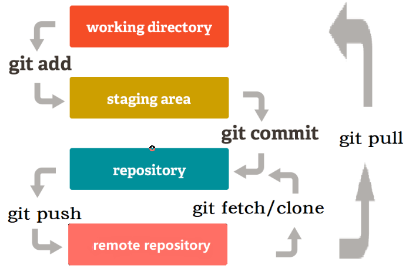
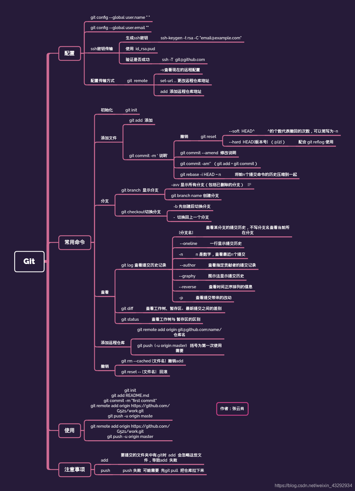

### 一、常用操作

git工作原理：





初始化git

```bash
git init
```

克隆远程仓库

```bash
git clone <远程仓库地址>
git clone --branch <branch name> <远程仓库地址> #拉取特定分支
```

推送到远程仓库

```bash
git push origin <branch name>
#如果新建的temp分支没有上游分支，则在上游（github）新建temp分支再push过去
git push --set-upstream origin temp
```

文件加入暂存区

```bash
git add <FileName>
或全部添加
git add *
```

代码回滚

```bash
git reset --hard <commit id>
```

代理配置

```bash
 git config --global https.proxy http://127.0.0.1:7890 #添加代理
 git config --global http.proxy http://127.0.0.1:7890 #添加代理
 git config --global --unset https.proxy #取消代理
```

更新代码：

[(6条消息) git更新代码_My.科研小菜鸡的博客-CSDN博客_git 更新代码](https://blog.csdn.net/qq_41861406/article/details/124571502)


使commit记录保持干净：

https://about.gitlab.com/blog/2020/11/23/keep-git-history-clean-with-interactive-rebase/


git cherry-pick:[git cherry-pick 教程 - 阮一峰的网络日志 (ruanyifeng.com)](https://www.ruanyifeng.com/blog/2020/04/git-cherry-pick.html)

将某个branch的某个commit摘取，接到当前分支上（可能发生冲突

```bash
git cherry-pick <commitHash> # 应该可以加个签名-S，还未尝试
```


### 二、设置个人信息

在没有GPG签名情况下 user.email 决定了github的commit的人是谁。（甚至可以假装成Linus）

```bash
git config --global user.name <"你的匿名">
git config --global user.email <"你的邮箱">
#也可以在当前项目里设置信息，局部优先于global
git config user.name <"你的匿名">
git config user.email <"你的邮箱">
```

### 三、分支操作

```bash
# 根据某个分支commit id创建新的分支
git branch <new branch name> <commit id>
# 查看分支
git branch
# 删除分支
git branch -d <branch name>
# 切换分支
git checkout <branch name>
#从当前分支基础上上创建新的分支，并推送到远程仓库
git checkout -b <new branch name>
git push --set-upstream origin <new branch name/commit hash>
```

### 四、查看各种信息

```bash
git status # 查看文件状态
git branch # 查看分支
git branch -vv # 查看分支所在remote
git reflog # 本地操作（commit、checkout、rebase等）历史查看
git log # 项目当前分支指向结点的commit历史
git log --show-signature #增加gpg签名信息
git show <commit id> #查看commit的修改内容
```

### 五、git remote origin数据源

```bash
# 查看当前remote origin
git remote -v
# 关联远程仓库
git remote add <origin> <ssh或https地址>
# 更换remote中origin例子
git remote set-url origin git@github.com:hanyisong/testGPGSigned.git
#取消fetch或push，本质上是修改url
git remote set-url --push <name> no_push
#删除origin
git remote remove <origin name>
```

### 六、commit自动署名

```bash
git commit --signoff -m 'message content'
git commit -s -S -m 'message content' #加上GPG signed
```

如果忘记署名，可以通过下面命令编辑commit消息

```bash
git commit --amend -s # --amend修改之前的commit -s签名
```

### 七、合并commit

参考[git 合并commit - 码农教程 (manongjc.com)](http://www.manongjc.com/detail/25-jeukveeivdswfjm.html)


1、查看commit历史

```bash
git log #项目当前结点的commit历史
```

#### 7.1 第一种合并commit（rebase变基）

如果操作中出现失误，使用`git rebase --abort` 撤回上次rebase

```bash
# 没有指定endpoint默认为当前分支HEAD所指向的commit，可以HEAD~x，也可以具体的commit id（git reflog或git log查看）
git rebase -i [startpoint] [endpoint] # 变基将startpoint设为他们新的基础结点（原来是HEAD）

#比如当前commit有 HEAD@{0}、HEAD@{1}、HEAD@{2}、HEAD@{3}、HEAD@{4}，序号越大越早存在
#合并前3个（可git reflog查看x编号），实际合并的是 HEAD@{0}、HEAD@{1}、HEAD@{2}
git rebase -i HEAD@{3} #可以push到远程main分支上
#合并HEAD@{2}、HEAD@{3}（注意！会丢失HEAD@{0}、HEAD@{1}，因为基点由HEAD变为HEAD@{4}）
git rebase -i HEAD@{4} HEAD@{2} #会变成一个分离的结点，导致不能push到远程main分支上
```

3、然后就自动进入了编辑界面，把要并入的commit都将pick改成squash，具体修改方法git有给出。（谁并入谁）

4、接下来就是修改commit消息，把之前的commit消息注释掉即可。

5、推送到远程仓库。

```
# feat-xxx为你的分支，-f是强制force update谨慎使用 -f 提交，因为会覆盖别人的代码
git push origin feat-xxx -f 
```

#### 7.2 第二种合并commit(软回退)

软回退，就是将提交信息回退到指定commitid，但是代码会被放在暂存区。如上我们可以这般

```bash
git reset --soft <commit id>
git log #发现commit log 也回去了
```

虽然回退了，但是莫慌，看看你代码，还是最新的，代码并没有回退。代码已经被保存到暂存区了

然后这个时候再重新commit和强推即可

```bash
git commit -m 'feat: 将几次修改readme的提交合并成一个'
git push -f
```

如果不强推报以下错误

```bash
! [rejected]  main -> main (non-fast-forward)
error: failed to push some refs to 'https://github.com/xxxx/test.git'
hint: Updates were rejected because the tip of your current branch is behind
hint: its remote counterpart. Integrate the remote changes (e.g.
hint: 'git pull ...') before pushing again.
hint: See the 'Note about fast-forwards' in 'git push --help' for details.
```

### 八、手动更新上游代码

两种方式根据实际情况选择使用。

#### 方式一

上游源统一命名为upstream

```bash
#关联远程remote，远程源命名为upstream
git remote add upstream <ssh或https地址>
#取消push，本质上是修改url
git remote set-url --push upstream no_push
#拉取远程分支代码，branch是你要的分支
git fetch upstream <branch>
#合并代码
git merge upstream/<branch>
```

#### 方式二

方便，但是有时候不好用

```bash
#关联远程remote，远程源命名为upstream
git remote add upstream <ssh或https地址>
git pull upstream
```

### 九、在commit添加/删除GPG签名

在rebase时，会进行一系列的commit操作（封装好的），对用户是透明的看不到，会将基点之前的commit GPG签名全部删除，因为它本质是一系列的commit操作（我猜测的），所以我们可以利用这个特性自由地对commit添加/删除GPG签名（影响到基点之后的全部commit），接着在交互界面中将pick改成reword即可。

#### 1、rebase参数说明

git rebase的签名参数，引用自：[Git - git-rebase Documentation (git-scm.com)](https://git-scm.com/docs/git-rebase)

```
-S[<keyid>]
--gpg-sign[=<keyid>]
--no-gpg-sign
```

>GPG-sign commits. The `keyid` argument is optional and defaults to the committer identity; if specified, it must be stuck to the option without a space. `--no-gpg-sign` is useful to countermand both `commit.gpgSign` configuration variable, and earlier `--gpg-sign`.

#### 2、样例

使用`git log --show-signature`检查commit是否进行GPG签名。


1、添加gpg签名（基点之后的commit全部添加签名）

```
git rebase -S -i <commit id> #-S 与--gpg-sign 等价
```

接着将任意一个commit的pick改成reword保存后（这样才会触发rebase，并且不会对commit有其他改动），后面那个也不用动保存即可。


2、删除gpg签名（基点之后的commit全部删除签名）

```
git rebase --no-gpg-sign -i <commit id>
```

接着将任意一个commit的pick改成reword保存后（这样才会触发rebase，并且不会对commit有其他改动），后面那个也不用动保存即可。


### 十、other

1、commit id可以简短的5位或6位

2、HEAD@{x} == HEAD~x == commit id（x 需要指向该id）

3、github的仓库可以看成一个最上游的git仓库。

4、merge pull request 本质上就是commit之间的碰撞与结合

